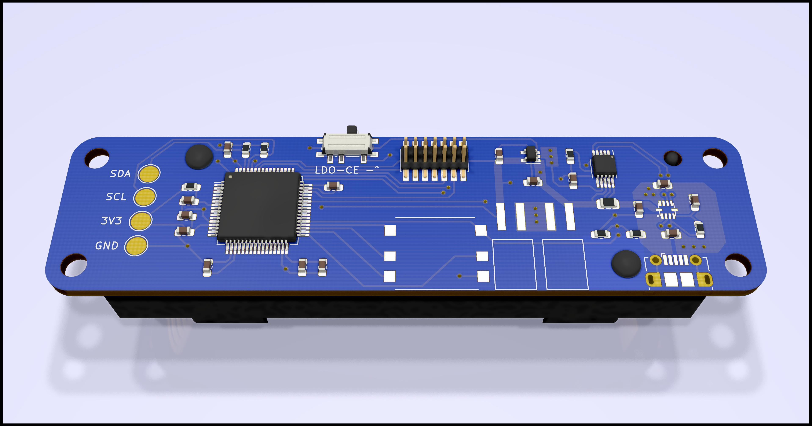

# 18650 UPS
My goal with this project is to power my development boards and experiments from a rechargable battery, so remaining a small footprint is obviously a key target. Ideally, the board should include conveniences like monitoring the power consumption and battery life. Charging should be done with standard USB Micro-B.

# Description
I decided for 18650 Li-Ion Cells as they are widely available and provide high capacity. Due to their metal casing they are also more robust than normal hobby grade LiPo batteries.
Of course, there are countless 18650 compatible supply boards for projects already, but they all miss certain features or raise serious quality and safety concerns.

So i set out to design my own PCB that mounts directly to the back of a single cell holder.

# Safety
As all Li-Ion batteries should be treated with great care, my desired safety features are:

- Overcharge cutoff
- Safety timer during charge phase
- Overcurrent protection / Current limiting
- Short circuit protection
- **Configurable** Under-voltge cutoff
- Battery disconnect during storage
- Temperature warnings

# Part Selection

- **MP2667**        - I2C programmable Charge IC with heaps of safety features and output current limiting
- **INA237**        - 16-Bit current, power, temperature and voltage monitor with I2C Interface
- **STM32L151RCT6** - Simply because i had them lying around
- **1.3" OLED**     - To configure the charger and display sensor data

# Current State Of Project

The non-ideal switchmode regulator layout and method of seperatig the chargin IC and protection IC resulted in problems. In the current version switchmodes are omitted and all safety features are integrated in one high quality IC. The monitoring capabilities have been enhanced and a bigger display replaced the old one.

All parts for version 3 are ordered. Patiently waiting for snail post to arrive...
